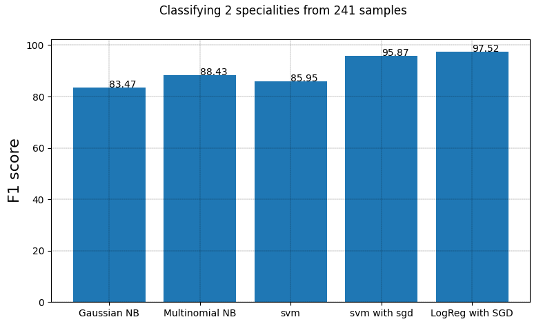

# medical NLP project
## Going to try and predict medical speciality based on medical transcript
Dataset found on kaggle. Cannot find the URL so uploaded it here.

Code implements a simple bag of words, from sklearn tutorial (https://scikit-learn.org/stable/tutorial/text_analytics/working_with_text_data.html)

df.columns:
Index(['index', 'description', 'medical_specialty', 'sample_name','transcription', 'keywords']

There are 39 medical specialities:
```
array(['Allergy / Immunology', 'Bariatrics', 'Cardiovascular / Pulmonary',
       'Dentistry', 'Urology', 'General Medicine', 'Surgery',
       'Speech - Language', 'SOAP / Chart / Progress Notes',
       'Sleep Medicine', 'Rheumatology', 'Radiology',
       'Psychiatry / Psychology', 'Podiatry', 'Physical Medicine - Rehab',
       'Pediatrics - Neonatal', 'Pain Management', 'Orthopedic',
       'Ophthalmology', 'Office Notes', 'Obstetrics / Gynecology',
       'Neurosurgery', 'Neurology', 'Nephrology', 'Letters',
       'Lab Medicine - Pathology', 'IME-QME-Work Comp etc.',
       'Hospice - Palliative Care', 'Hematology - Oncology',
       'Gastroenterology', 'ENT - Otolaryngology', 'Endocrinology',
       'Emergency Room Reports', 'Discharge Summary',
       'Diets and Nutritions', 'Dermatology',
       'Cosmetic / Plastic Surgery', 'Consult - History and Phy.',
       'Chiropractic'])	   
```

I'd like to classify medical speciality based on keywords.
It's easy to change which speciality to keep using:
```
df = df[df['medical_specialty'].isin(['Neurosurgery','Neurology'])]
```

I used [Gaussian NB](https://scikit-learn.org/stable/modules/generated/sklearn.naive_bayes.GaussianNB.html), 
[Multinomial NB](https://scikit-learn.org/stable/modules/generated/sklearn.naive_bayes.MultinomialNB.html),
[SVM from Linear model](https://scikit-learn.org/stable/modules/generated/sklearn.svm.LinearSVC.html),
SVM from SGDClassifier, and logistic regression from SGDClassifier [both here](https://scikit-learn.org/stable/modules/generated/sklearn.linear_model.SGDClassifier.html).

Input data is discrete so Gaussian NB should perform badly because it assumes features of a continuous nature.
Multinomial NB is its discrete classification equivalent.

Example 1: Classify between Neurosurgery and Neurology:

 

Example 2: Classify between all specialities:

 